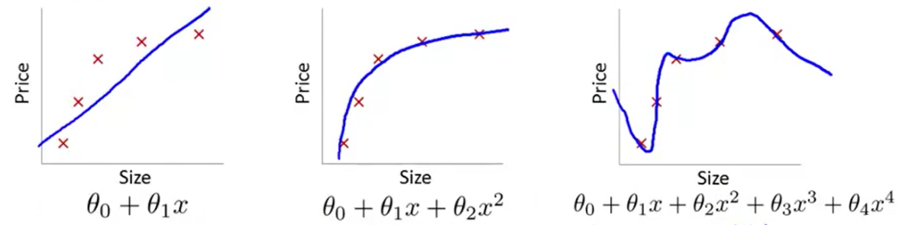
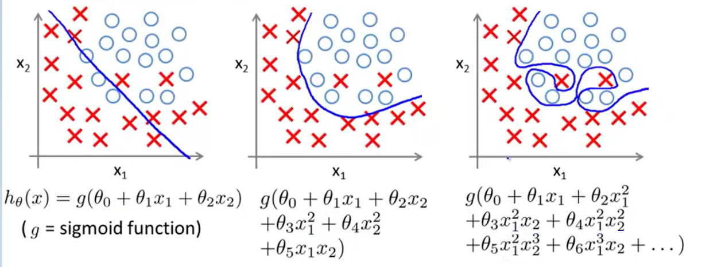

# 过拟合（Overfitting）

[过拟合（Overfitting）-知乎](https://zhuanlan.zhihu.com/p/138044812 "超链接title")

## 问题的产生

当我们构建模型时，总会希望假设空间参数尽可能多，因为系统越复杂，拟合得越好嘛。
我们还希望我们的优化算法能使我们的模型产生的损失函数的值尽可能小（即我们的假设空间能够贴合每一个训练样本点）。
但这样真的好吗？奥卡姆剃刀貌似又胜利了。然而假设我们的模型达成了上述的情况，有很大概率产生一个ML界非常令人头疼的一件事：**过拟合（Overfitting）**。

什么是过拟合呢？举一个简单的例子：我们设计了一个模型来判断 一件物品是否为树叶。喂养这个模型的数据集中含有几张带有尖刺边缘的树叶。
模型的设计者希望模型能满足每一个训练数据，模型就将尖刺边缘也纳入了参数中。
当我们测试这个模型的泛化性能时，就会发现效果很差，因为模型钻牛角尖，它认为树叶必须带有尖刺边缘，所以它排除了所有没有带有尖刺边缘的树叶，但事实上，我们知道树叶并不一定带有尖刺边缘。
结果为什么会这样？因为模型设计者的强迫症使得这个模型过分贴合整个训练集，结果把噪音点也拟合上了。

## 欠拟合与过拟合

以“波士顿房价预测”为例，来从图像的角度直观感受一下什么叫过拟合，顺便也介绍一下欠拟合：

### 例1：线性回归（房价预测）

> Fig.1 Linear regression（截屏自吴恩达机器学习）

我们看到第一张图的模型过于简单，而且损失函数的收敛速度很慢。这就使得优化算法做得再好，我们的模型的泛化性能也会很差，因为这条直线在训练集上的cost就很大，我们把这种训练集上的偏差很大的情况叫做**欠拟合（Underfitting）**，也有一种历史叫法：**高偏差（High bias）**。

第二张图是我们合理假设的一个模型。可以看到，选取了合理的模型后，图像大致穿过了样本点。像极了做物理实验时，最后用一条曲线大致地穿过既定的样本点；和第一张图比起来，至少损失值大大下降了。

第三张图引入了高次项，就题论题来说，这太复杂了。虽然事实上对于是任意n个点，总能找到n+1次曲线方程将这n个点全部穿过，但是从模型的角度来讲，这显然不是好模型（姑且不说要用一个高次模型去拟合离散点要迭代多少次，学习率要调到多低）。即使它一板一眼地穿过了所有样本点，但谁能保证这种奇形怪状的曲线能穿过下一个随机给出的样本点呢？我们把这种和预测值和样本标签值几乎完全一致的情况叫做**过拟合（Overfitting）**，历史上也称为**高方差（High variance）**。

### 例2：**Logistic回归**

> Fig2.Logistic regression（截屏自吴恩达机器学习）

三幅图哪个更好呢？不多说，第二张图应该是合理的划分方式，而不是像第三张图那样一板一眼

## 定义

> **Overfitting** : If we have too many features, the learned hypothesis may fit the training set vey well, but fail to generalize to new examples.

其中的'fit the training set very well'的数学语言是：$\frac{1}{2N} \sum_{i=1}^{N} \left (h_\theta \left ( x^\left ( i \right )  \right )  -y^\left ( i \right ) \right )^2\approx 0 (or=0) $

所以过拟合就是损失函数极小但泛化性能差的情况。落实在分类问题上就是训练集的损失函数值很小，但是验证集/测试集上的损失函数值很大。

这也说明了我们在训练模型时，损失函数关于迭代次数的图像一直下降到很小的数值并不是什么好事，这恰恰暗示了我们的模型存在过拟合的风险。

## 解决过拟合

我们一般有两种方法来减小过拟合的影响：

1.减少属性值（特征值）的数量。

- 人工选择哪些特征需要保留。
- 使用模型选择算法。例如：DROP-OUT

2.实行正则化

- 保留所有特征值，但是减小参数 θ_j 的值或数量级。
- 当我们有许多特征时，效果较好。其中每一个特征值都会对y造成影响。
