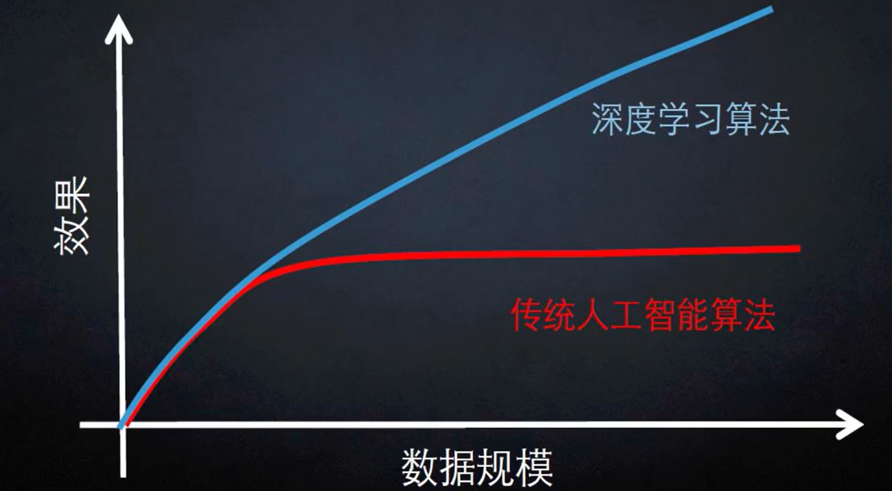

# 深度学习

## 深度学习与机器学习的关系

深度学习是机器学习的一个重要分支，它是机器学习的高级玩法，更加接近真正的人工智能

### 什么是深度学习

让计算机自动提取特征，让计算机学习什么特征是最合适的

深度学习解决了机器学习中如何提取特征这一问题

## 深度学习的应用

计算机视觉（传入图像数据）、自然语言处理（传入文本数据）

如：图像分类、识别、无人驾驶、语音识别、机器翻译

## 数据集

最大的图像集网站：www.image-net.org

自己用笔记本玩的时候，用不上这么大的数据集

推荐使用CIFAR-10这个数据集进行训练

## 深度学习存在的问题

需要的数据量（参数量）大，硬件要求高，速度慢

在数据规模不大的时候，效果与传统机器学习算法差不多

所以深度学习需要更多的数据和算力作为支撑才能发挥其优势



## 得分函数

**得分函数**就是对于给定的一个输入，通过计算，得到这个输入属于每种类别的得分。比如我们现在有三个类别：小猫、小狗和青蛙，对于一张给定的图片，计算出这个图片是小猫的得分，是小狗的得分以及是青蛙的得分。

例如猫狗分类器，我们的目标是识别一张图片中的动物是猫还是狗

计算机就需要分析图片的每个像素（例如32*32*3的图片就有3072个像素）

> 32*32*3：指图片的宽、高、RGB
RGB是个颜色标准，表示用三原色的组合来表示所有颜色
即每个原色用1个像素显示，表示该原色的深度或者亮度
3个原色分别不同亮度的组合就能显示出大部分颜色
> 

计算每个像素的得分，某些像素对于机器识别动物起促进作用则分数应该高些，某些像素会起抑制作用则分数低些（例如图片中的背景）

一般用 f(x, W, b) = Wx+b 得到这张图片中的动物属于猫的得分和属于狗的得分

x是像素
W是权重参数
b是偏置参数，用于微调结果

3072个像素点要对应3072个权重参数

把3072个权重参数放入1×3072的矩阵中，把3072个像素点放入3072×1的矩阵中

通过得分函数 f(x, W) = Wx 最后得到该图片属于某一类动物的得分

此处有3个类别，应该有3组1×3072的权重参数矩阵，组成3×3072的矩阵

此时通过得分函数 f(x, W) = Wx 得到一个3×1的得分矩阵，即猫狗船的分别得分


注意这里是10个类别，不是举例里的3个类别


这里将图片简化为4个像素、要分3个类别，看计算方法

得分函数是个线性函数

### 线性关系

两个变量之间存在一次函数关系，就称它们之间存在线性关系

正比例关系是线性关系中的特例，反比例关系不是线性关系

更通俗一点讲，如果把这两个变量分别作为点的横坐标与纵坐标，其图象是[平面](https://baike.baidu.com/item/%E5%B9%B3%E9%9D%A2/3707020?fromModule=lemma_inlink)上的一条直线，则这两个变量之间的关系就是**线性关系**

在高等数学里，**线性函数**是一个线性映射，是在两个向量空间之间，维持向量加法与标量乘法的映射


## 损失函数

损失函数用于对结果好坏的指导

例如给出一个图像，该图像作为输入数据传入线性函数（猫狗分类器），函数给出结果（该图像为猫/狗），损失函数就要分析该结果效果有多好或者有多坏


参数矩阵W一开始全是随机值，所以示例里3个类别的得分并不是最终得分

此时就需要损失函数对这个结果进行衡量，衡量这个结果有多差


### 如果损失函数的值相同，那么意味着两个模型一样吗？


可以看到上诉例子里，模型A和模型B的损失函数的值都是一样

但是模型A只考虑局部，产生了过拟合（Overfitting），即太过贴合训练数据集了，这不是我们想要的

### 为了避免模型的过拟合现象，需要加入正则化惩罚项改进损失函数


我们总希望模型不要太复杂，过拟合的模型是没有用的


## softmax分类器

了解完得分函数后，我们由一个输入得到了一个得分值

仔细想想，给我一个得分值，我还需要与其他分类的得分去比较大小，能不能直接给出一个概率呢？


## 前向传播（forward）的整体流程

简单理解就是将上一层的输出作为下一层的输入，并计算下一层的输出，一直到运算到输出层为止


由传入数据x和权重参数W通过得分函数得到得分值

再由得分值和权重参数得到整体的损失值，这一过程就叫前向传播

## 梯度下降

> 在高中阶段学过一个**「极值」**的概念
梯度下降法的作用就是寻找一个**「极小值点」**（在本篇文章讨论极小值，顾名思义：梯度下降法），从而**让函数值尽可能地小**
> 

**梯度下降法在机器学习中常常用来优化损失函数，找出最小损失值**

但是一个函数可能存在多个极小值点，那梯度下降法找到的是哪一个呢？

关于这个问题就要看运气了，算法的最开始会 **「随机」** 寻找一个位置然后开始搜索**「局部」**的最优解，如果运气好的话能够寻找到一个最小值的极值点，运气不好或许找到的就不是最小值的那个极小值点了。


比如上门的这个函数图像f(x)=x⋅sin⁡(x), 可以发现在当前这个区间范围内这个函数有两个极小值点，如果我们想寻找当前函数在这个区间内的最小值点，那么当然是第二个极小值点更合适一些，可是并不一定能够如我们所愿顺利地找到第二个极小值点，这时候**只能够通过多次尝试**。

### 梯度下降运行过程

接下来用一个简单的一元二次函数来阐述算法的运行过程。一元二次函数天生地就只有一个极小值点，方便用来说明问题。函数的表达式是 f(x)=(x−1)^2+1,通过表达式可以知道它的最小值点的坐标是 (1,1)


**「梯度的概念」**：梯度就是函数对它的各个自变量求偏导后，由偏导数组成的一个向量。
函数f(x)的梯度就是它的导数f’(x)，f’(x) = 2x-2

现在来看，刚才的图上有一个小红点，它的坐标是 (6, f(6)), 也就是当x=6的时候二次函数曲线上边儿的点。那么也可以得到f(6)′=10也就是这个红点的位置的导数是等于10。

现在用导数值的**「正负来表示方向」**，如果导数的值是正数，那么就代表x轴的正方向。如果导数的值是负数，那么就代表是x轴的负方向。那么你会发现，知道了这个方向之后也就知道了应该让x往哪个方向变化f(x)的值才会增大。如果想要让f(x)的值减小，那么就让x朝着导数告诉我们的方向的反方向变化就好啦。


用**「黄色」**箭头代表导数告诉我们的方向，用**「黑色」**箭头代表导数指向的方向的反方向

**「梯度下降法」**的目标是搜索出来一个能够让函数的值尽可能小的位置，所以应该让x朝着黑色箭头的方向走，那么怎么完成这个操作呢？接下来的过程我使用伪代码来表示。

在代码中有一个eta变量，它的专业名词叫**「学习率」**。使用数学表达式来表示更新x的过程那就是：

$$
x\leftarrow x-eta\times \frac{df\left ( x \right ) }{dx} 
$$

表达式的意思就是让x减去eta乘以函数的导数

其中的eta是为了控制x更新的幅度，将eta设置的小一点，那么每一次更新的幅度就会小一点

> eta一般都设置的小一点
eta可以理解为步长
曲线可以细分为无数段的小直线线段，要走曲线就可以转化为走小直线线段
一旦步长过大，就会走偏
同理，损失函数在坐标轴上表现为一条曲线，我们要沿着损失函数走，就必须把步长设置小一点
> 

```python
「初始化：」
# 变量 x 表示当前所在的位置
# 就随机初始在 6 这个位置好了
x = 6
eta = 0.05

「第 1 次更新 x」
# 变量 df 存储当前位置的导数值
df = 2*x-2
x = x - eta*df
# 更新后 x 由 6 变成 
# 6-0.05*10 = 5.5

「第 2 次更新 x」
# 因为 x 的位置发生了变化
# 要重新计算当前位置的导数
df = 2*x-2
x = x - eta*df
# 更新后 x 由 5.5 变成
# 5.5-0.05*9 = 5.05
```


其中红色箭头指向的点是初始时候的点
**「黄色」** 箭头指向的点是第 1 次更新后的位置
**「蓝色」** 箭头指向的点是第 2 次更新后的位置

只要不停地重复刚才的这个过程，那么最终就会收敛到一个 **「局部」** 的极值点。

因为随着每一次的更新，曲线都会越来越平缓，相应的导数值也会越来越小，当我们接近极值点的时候导数的值会无限地靠近 **「0」**。由于导数的绝对值越来越小，那么随后更新的幅度也会越来越小，最终就会停留在极值点的位置了。

接下来我将用 Python 来实现这个过程，并让刚才的步骤迭代 1000 次

**「算法初始化」**

```python
import matplotlib.pyplot as plt
import numpy as np

# 初始算法开始之前的坐标 
# cur_x 和 cur_y 
cur_x = 6
cur_y = (cur_x-1)**2 + 1
# 设置学习率 eta 为 0.05
eta = 0.05
# 变量 iter 用于存储迭代次数
# 这次我们迭代 1000 次
# 所以给它赋值 1000
iter = 1000
# 变量 cur_df 用于存储
# 当前位置的导数
# 一开始我给它赋值为 None
# 每一轮循环的时候为它更新值
cur_df = None

# all_x 用于存储
# 算法进行时所有点的横坐标
all_x = []
# all_y 用于存储
# 算法进行时所有点的纵坐标
all_y = []

# 把最一开始的坐标存储到
# all_x 和 all_y 中
all_x.append(cur_x)
all_y.append(cur_y)
```

**「迭代 1000 次」**

```python
# 循环结束也就意味着算法的结束
for i in range(iter):
    # 每一次迭代之前先计算
    # 当前位置的梯度 cur_df
    # cur 是英文单词 current 
    cur_df = 2*cur_x - 2
    # 更新 cur_x 到下一个位置
    cur_x = cur_x - eta*cur_df
    # 更新下一个 cur_x 对应的 cur_y
    cur_y = (cur_x-1)**2 + 1

    # 其实 cur_y 并没有起到实际的计算作用
    # 在这里计算 cur_y 只是为了将每一次的
    # 点的坐标存储到 all_x 和 all_y 中
    # all_x 存储了二维平面上所有点的横坐标
    # all_y 存储了二维平面上所欲点的纵坐标
    # 使用 list 的 append 方法添加元素
    all_x.append(cur_x)
    all_y.append(cur_y)
```

**「绘图」**

```python
# 这里的 x, y 值为了绘制二次函数
# 的那根曲线用的，和算法没有关系
# linspace 将会从区间 [-5, 7] 中
# 等距离分割出 100 个点并返回一个
# np.array 类型的对象给 x
x = np.linspace(-5, 7, 100)
# 计算出 x 中每一个横坐标对应的纵坐标
y = (x-1)**2 + 1
# plot 函数会把传入的 x, y
# 组成的每一个点依次连接成一个平滑的曲线
# 这样就是我们看到的二次函数的曲线了
plt.plot(x, y)
# axis 函数用来指定坐标系的横轴纵轴的范围
# 这样就表示了 
# 横轴为 [-7, 9]
# 纵轴为 [0, 50]
plt.axis([-7, 9, 0, 50])
# scatter 函数是用来绘制散点图的
# scatter 和 plot 函数不同
# scatter 并不会将每个点依次连接
# 而是直接将它们以点的形式绘制出来
plt.scatter(np.array(all_x), np.array(all_y), color='red')
plt.show()
```

**「图片效果」**


通过最终的效果图可以发现，**「梯度下降」**在一步一步地收敛到二次函数的极小值点，同时也是二次函数的最小值点。

仔细看一下，可以发现，就像刚才提到的，随着算法的运行，红色的点和点之间的距离越来越小了，也就是每一次更新的幅度越来越小了。这可不关**「学习率」** 的事儿，因为在这里用到的学习率是一个固定的值，这只是因为随着接近极值点的过程中**「导数的绝对值」**越来越小。

同时，我们还可以把 all_x 和 all_y 中最后一个位置存储的值打印出来看一下，如果没错的话，all_x 的最后一个位置的值是接近于 1 的，同时对应的函数值 all_y 最后一个位置的值也应该是接近于 1 的


### 二元函数的梯度下降

在多元函数中拥有多个自变量，在这里就用二元的函数来举例子好了，二元函数的图像是在三维坐标系中的。下边儿就是一个多元函数的图像例子。在这里纵坐标我使用 **「y」** 表示，底面的两个坐标分别使用 **「x1」** 和 **「x2」** 来表示。不用太纠结底面到底哪个轴是 x1 哪个轴是 x2，这里只是为了说明问题。


通过上面的二元函数凸显可以发现想要让 **「y」** 的值尽可能地小就要寻找极值点（同样地这个极值点也不一定是最小值点）。梯度是一个由各个自变量的偏导数所组成的一个**「向量」**。用数学表达式表示：

$$
\left ( \frac{\partial y}{\partial x_1} ，\frac{\partial y}{\partial x_2} \right )
$$

算法的过程和上诉例子里用的二次函数是一样的，为了直观，我就直接使用数学式子的方式表达出来。

$$
x_1\leftarrow x_1-eta\times \frac{\partial y}{\partial x_1} ，
x_2\leftarrow x_2-eta\times \frac{\partial y}{\partial x_2}   
$$

同样地，一开始随机初始一个位置，随后让当前位置的坐标值减去学习率乘以当前位置的偏导数。更新自变量 x1 就让 x1 减去学习率乘以 y 对 x1 的偏导数，更新自变量 x2 就让 x2 减去学习率乘以 y 对 x2 的偏导数。

> 由于x1、x2两个样本数据之间是没有任何关系的，所以x1、x2的更新是分别进行的
> 

发挥想象力再思考一下，既然**梯度是一个向量**，那么它就**代表了一个方向**。 x1 的偏导数的反方向告诉我们在 x1 这个轴上朝向哪个方向变化可以使得函数值 y 减小，x2 的偏导数的反方向告诉我们在 x2 这个轴上朝向哪个方向变化可以使得函数值 y 减小。那么，由偏导数组成的向量就告诉了我们在底面朝向哪个方向走就可以使得函数 y 减小。


图中，我使用红色箭头表示我们当前所在的位置
**「黑色」** 箭头代表其中一个轴上的坐标朝向哪个方向变化可以使得函数值 **「y」** 减小
**「黄色」** 箭头代表另外一个轴上的坐标朝向哪个方向变化可以使得函数值 **「y」** 减小
根据平行四边形法则有了 **「黑色」** 向量和 **「黄色」** 向量，就可以知道这两个向量最终达到的效果就是 **「蓝色」** 向量所达到的效果

最终，对于二元函数梯度下降的理解，就可以理解为求出的梯度的反方向在底面给了我们一个方向，只要朝着这个方向变化底面的坐标就可以使得函数值 **「y」** 变小

上面的数学公式可以转化为向量的形式：

$$
\begin{pmatrix} x_1\\ x_2  \end{pmatrix} \leftarrow \begin{pmatrix}x_1\\x_2  \end{pmatrix} -eta\times\begin{pmatrix}    \frac{\partial y}{\partial x_1}\\    \frac{\partial y}{\partial x_2}  \end{pmatrix} 
$$

同理，多元函数的梯度下降

$$
\begin{pmatrix}  x_1\\  x_2\\...\\x_n\end{pmatrix} \leftarrow \begin{pmatrix}  x_1\\  x_2\\...\\x_n\end{pmatrix} -eta\times\begin{pmatrix}  \frac{\partial y}{\partial x_1}\\  \frac{\partial y}{\partial x_2}\\...\\\frac{\partial y}{\partial x_n}\end{pmatrix} 
$$

## 参数更新、优化参数设置


## 反向传播（backward）

实际上，**反向传播仅指用于计算梯度的方法**

而另一种算法，例如随机梯度下降法，才是使用该梯度来进行学习

由前向传播得到一个损失值

由高损失值反向调节权重参数W（使得损失值下降），从而优化模型


## 什么是神经网络

神经网络是一种模拟人脑的神经网络以期能够实现类人工智能的机器学习技术

它由大量互连的神经元组成，通过调整神经元之间的连接权重来学习输入和输出之间的关系


- 神经元：指的是特征的数量
    - eg. 人的信息（年龄、身高、体重），这里就是三个特征，就是三个神经元
    - eg. 上诉输入图片数据，有32×32×3个像素点，也就是3072个特征，就是3072个神经元
- 全连接：指的是特征x与权重参数矩阵W的运算，每条连线都对应一个权重
    - eg. f(x, W) = Wx
- 非线性：指的是神经元每次经过一组权重参数后，要对计算结果进行一次非线性变换（激活函数）

### 神经元个数对结果的影响：神经网络可视化展示

[ConvNetJS demo: Classify toy 2D data (stanford.edu)](https://cs.stanford.edu/people/karpathy/convnetjs/demo/classify2d.html)

看神经元个数对结果的影响


神经元个数为1时，分类效果不好（不能区分红球区域和绿球区域）


明显看到神经元个数为3时，分类效果好（很好区分开了红球和绿球）

理论上，神经元个数越多越好

实际上要考虑硬件条件


## 激活函数

神经网络经过一组权重参数计算（得分函数）后，要对计算结果进行一个非线性变换

激活函数就是这个非线性变换

常用的激活函数：Sigmoid、Relu、Tanh等


从Sigmoid函数的图像可以看出，当数值过大或过小的时候，会出现梯度接近0的情况，即梯度消失

> x × W_1 × W_2 × W_3 × W_4：当W_3为0时，整个计算结果也就为0了
> 

由于这个梯度消失的情况，现在已经不用Sigmoid函数了

**现在大多情况下都是用Relu激活函数**

## 数据预处理


## 参数初始化

通常使用随机策略来进行参数初始化

初始化权重参数矩阵：`W = 0.01 * np.random.randon(D, H)`

> 乘上一个较小的数（0.01）可以减小参数之间的浮动差异
> 

## 过拟合（Overfitting）

过拟合与欠拟合

> **Overfitting** : If we have too many features, the learned hypothesis may fit the training set vey well, but fail to generalize to new examples.
> 

举一个简单的例子：我们设计了一个模型来判断 一件物品是否为树叶。喂养这个模型的数据集中含有几张带有尖刺边缘的树叶。

模型的设计者希望模型能满足每一个训练数据，模型就将尖刺边缘也纳入了参数中。

当我们测试这个模型的泛化性能时，就会发现效果很差，因为模型钻牛角尖，它认为树叶必须带有尖刺边缘，所以它排除了所有没有带有尖刺边缘的树叶，但事实上，我们知道树叶并不一定带有尖刺边缘。

结果为什么会这样？因为模型设计者的强迫症使得这个模型过分贴合整个训练集，结果把噪音点也拟合上了。

## 减小过拟合的方法

我们一般有两种方法来减小过拟合的影响：

1.减少属性值（特征值）的数量。

- 人工选择哪些特征需要保留。
- 使用模型选择算法。例如：DROP-OUT

2.实行正则化

- 保留所有特征值，但是减小参数 θ_j 的值或数量级。
- 当我们有许多特征时，效果较好。其中每一个特征值都会对y造成影响。

**DROP-OUT**

每次训练的时候在每一层随机选择部分参数不参与进来


左图是全连接，右图是使用DROP-OUT算法

[动手实现神经网络模型](https://www.notion.so/9fa673e4b1ca47e38520648d5701a4b8?pvs=21)